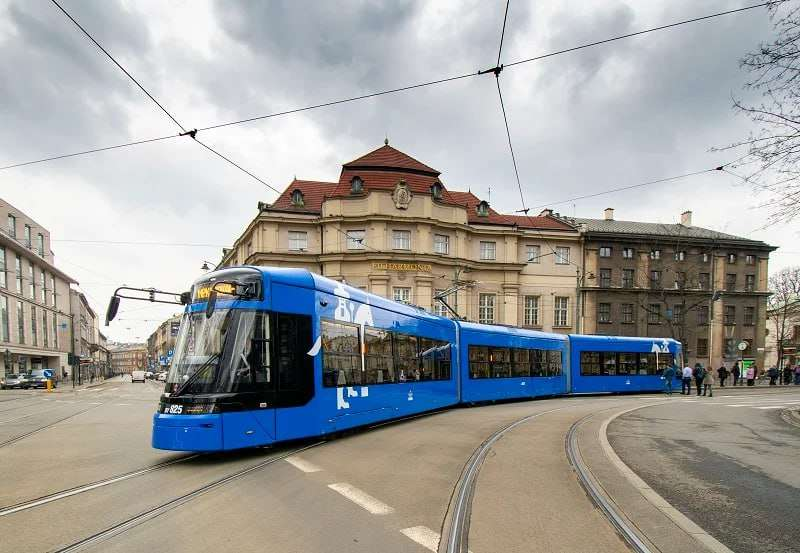

# Public-transport
 solomiia_1
INTRODUCTION
Public transportation in Krakow is a well-structured network that supports the city’s residents and tourists, providing an accessible, affordable, and eco-friendly alternative to driving. The system is managed by the Municipal Transport Authority (MPK Kraków) and includes a range of transport options such as trams, buses, and night lines. This extensive network connects the city’s historical areas, residential neighborhoods, and surrounding districts, making it convenient for people to navigate Krakow efficiently without a car. Krakow’s commitment to sustainable transportation contributes to its reputation as a forward-thinking city focused on environmental and urban mobility.

The tram network, an essential component of Krakow’s public transportation, offers extensive coverage across the city. With over 20 tram lines operating regularly, it is one of the fastest ways to reach popular destinations like the Old Town, Kazimierz, and Nowa Huta. Trams generally run from early morning to midnight, with select night services available. These trams are equipped with modern facilities, including accessibility features for those with disabilities, real-time information displays, and comfortable seating. As Krakow continues to modernize its tram infrastructure, it solidifies its commitment to enhancing public transportation for residents and visitors alike.

Additionally, buses play a crucial role in extending public transportation beyond the tram lines, covering areas not served by trams and connecting Krakow with nearby suburbs. Bus routes vary from local stops to express lines, offering flexibility for commuters and tourists. Many buses are equipped with Wi-Fi and USB charging ports, providing extra convenience to travelers. Night buses operate to ensure 24-hour access to public transportation, catering to late-night workers and travelers. Together with trams, Krakow’s buses form a comprehensive public transit system that accommodates the city’s growing population while encouraging a shift toward sustainable urban transport.

### DATA

The table below provides an overview of key tram and bus lines within Krakow’s public transportation system, highlighting routes, main stops, and typical operating hours. These popular lines connect major areas, offering convenient access to Krakow’s most frequented destinations.

| Line Type | Line Number | Route                               | Operating Hours          |
|-----------|-------------|--------------------------------------|--------------------------|
| Tram      | 4           | Bronowice - Nowa Huta               | 5:00 AM - 12:00 AM       |
| Bus       | 252         | Krakow Airport - Osiedle Podwawelskie | 4:30 AM - 11:00 PM       |
| Tram      | 50          | Krowodrza Górka - Kurdwanów         | 4:45 AM - 12:15 AM       |

This table provides insight into Krakow’s efficient scheduling and well-connected public transit routes that support easy travel across the city.

### IMAGES

Below are images that showcase public transportation in Krakow, including trams, buses, and the infrastructure that supports the city's transit system. These visuals highlight the efficiency and accessibility of Krakow’s public transportation network.

1. **Krakow Tram in Old Town**  
   

2. **Krakow City Bus**  
   

3. **Modern Krakow Tram** 

These images give an overview of Krakow’s well-maintained and modern public transportation system that connects various parts of the city.

## TEAM 
### Polina Minkova 2,3
### Solomiia Vikovych 1,6
### Viola Paderina 4,5
main
